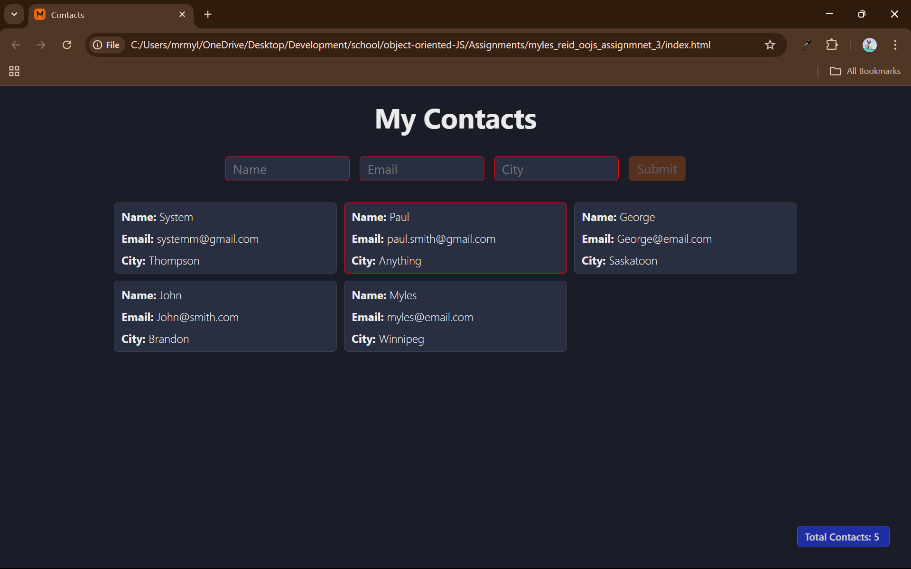

# Contact Page
Simple little program to enter and save contact name, email and city. There is no
data memory, so on a refresh of the page all contacts will be lost - potential for 
a future update.

The program does have the functionality to be able to dynamically delete contacts 
from the page, and it will keep the other contacts in the order that they were
added. 

---

## Features

- Basic name, email and city validation
- Dynamically add contact cards
- Dynamically remove contact cards
- Contact counter that is hidden unless there are contacts on the page
- Use of disabled buttons when there is no input.

---

## Lessons Learned

There were a lot of things that I had issues with, mostly in terms of actually
validating and having these done in the proper fashion. I did end up making everything
work the way that I wanted to in the end, although it was a real hair puller.

Some of the struggles were having the counter card show and hide based on if there
were cards present or not, as well as having issues with clearing the inputs 
consistently. 

Overall, there were many lessons learned and I'm sure there are even more, like how
to condense the card building section so it is not as long as it currently is.

---

## Screenshots

---

  
  
   

